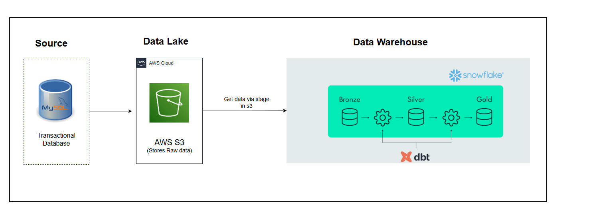
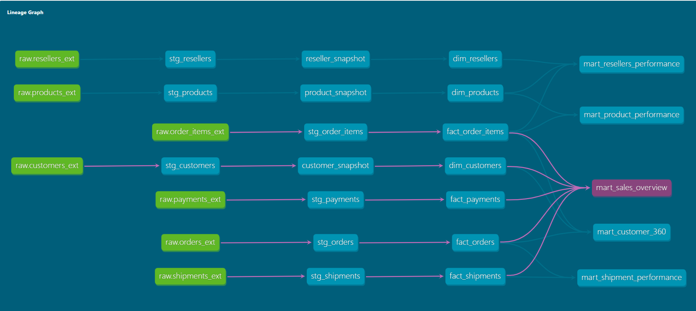
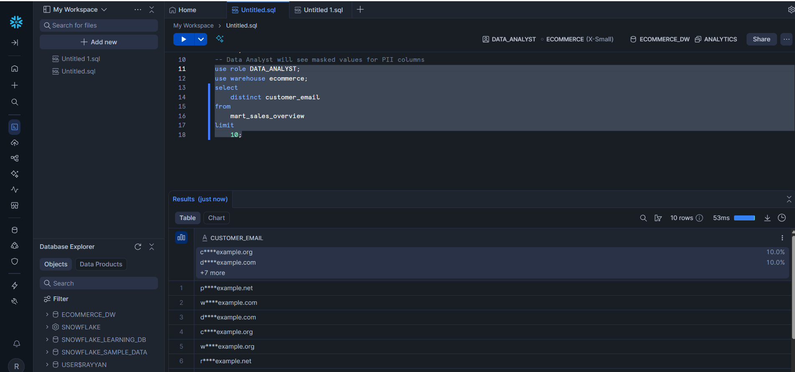
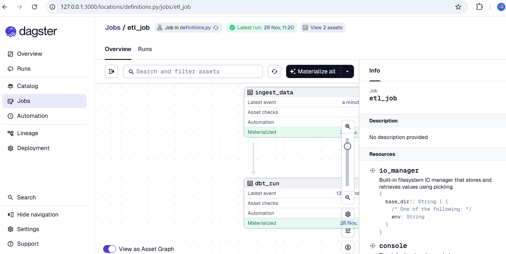

# 📦 E-Commerce Data Warehouse  
### *Cloud-Native Data Platform (AWS S3 · Snowflake · dbt · Dagster)*

This repository contains an end-to-end modern data platform implementing a cloud-native Data Lakehouse architecture. It leverages AWS S3 for raw data storage, Snowflake for warehousing and governance, dbt for transformation and modeling, and Dagster for orchestration and observability.

The solution is designed following the **Medallion Architecture (Bronze → Silver → Gold)** with enterprise-grade Data Governance features including RBAC, Dynamic Data Masking, and Row-Level Security (RLS).

---

## ⭐ Architecture Overview

<p align="center">
  
</p>

---

## 🏗️ Technology Stack

- **Python** — ingestion, automation, utilities  
- **AWS S3** — data lake & raw landing zone  
- **Snowflake** — cloud data warehouse  
  - Stages, External Tables, Secure Views  
- **dbt** — SQL transformations, lineage graph, testing, SCD Type 2  
- **Dagster** — workflow orchestration, scheduling, monitoring  

---

# 1. Data Platform Layers

## **Bronze Layer — Data Lake (AWS S3)**

Raw data is ingested and stored in Amazon S3.

- Stores unmodified raw files  
- Supports schema-on-read  
- Partitioned datasets (e.g., `ingestion_date=`) for efficient querying  
- **ingestion_state.json** tracks incremental ingestion  
- Connected to Snowflake through External Tables  
- High durability, low-cost storage  

---

## **Bronze → Silver → Gold (Snowflake Warehouse)**

### **Bronze Layer (Snowflake External Tables)**
- Reads raw files directly from S3  
- Minimal transformations applied  
- Audit-ready raw datasets  

### **Silver Layer**
Cleansed and modeled data produced using **dbt**:

- Staging models  
- Fact and dimension tables  
- SCD Type 2 dimensions for full historical tracking  
- Conformed and standardized schemas  

### **Gold Layer (Data Marts)**
Business-ready analytical models:

- Aggregated fact tables  
- Product analytics  
- Customer behavior models  
- RFM scoring  
- KPI-ready views  

---

# 2. Dimensional Modeling

### **Fact Tables**
- `fact_orders`  
- `fact_payments`  
- `fact_customers`
- `fact_order_items`
- `fact_shipments`

### **Dimension Tables**
- `dim_customers` — SCD Type 2  
- `dim_products` — SCD Type 2  
- `dim_resellers` — SCD Type 2  

### **Slowly Changing Dimensions (Type 2)**
- Maintains attribute history  
- Enables point-in-time analysis  
- Preserves previous attribute values via `valid_from`, `valid_to`, `is_current`  

---

# 3. dbt Transformations

<p align="center">
  
</p>

dbt implements all transformation logic across the warehouse:

- Staging transformations  
- Silver- and Gold-layer modeling  
- SCD Type 2 logic with snapshots  
- SQL models version-controlled in Git  
- Data tests for schema and assertions  
- Automatic lineage graph for end-to-end traceability  

---

# 4. Enterprise Data Governance (Snowflake)

All governance and security controls are implemented natively in Snowflake.

## **Role-Based Access Control (RBAC)**
Roles include:

- `DATA_ENGINEER` — full access to all layers  
- `DATA_SCIENTIST` — access to Silver/Gold  
- `DATA_ANALYST` — restricted/masked access  

---

## **Dynamic Data Masking**

Sensitive customer attributes—such as email and name—are masked automatically for non-privileged roles.

**Example (simplified) Masking Policy**  
```sql
Use database ecommerce_dw;
USE SCHEMA analytics;

--  create a masking policy 
CREATE OR REPLACE MASKING POLICY mask_email AS (val STRING) RETURNS STRING ->
  CASE
    WHEN CURRENT_ROLE() IN ('DATA_ENGINEER', 'DATA_SCIENTIST') THEN val
    ELSE CONCAT(SUBSTR(val,1,1), '****', SPLIT_PART(val,'@',2))
  END;

-- mask customer emails in the mart_sales_overview 

ALTER TABLE analytics.mart_sales_overview 
MODIFY COLUMN customer_email 
SET MASKING POLICY mask_email;
```


Engineers see full values, analysts see masked outputs.

<p align="center">  </p>

## **Row-Level Security (RLS)**

Access filtered by regional or business-unit boundaries.

**Example (simplified) Row Access Logic**

```sql
USE SCHEMA analytics;
-- Create row access policy for customer country
CREATE OR REPLACE ROW ACCESS POLICY rls_country AS (country STRING) RETURNS BOOLEAN ->
  CASE
    WHEN CURRENT_ROLE() IN ('DATA_ENGINEER', 'DATA_SCIENTIST') THEN TRUE
    ELSE country = 'Madagascar'  -- Example: restrict analysts to Madagascar only
  END;
-- Add row access to customer country column in the marts_sales_overview table
ALTER TABLE analytics.mart_sales_overview
ADD ROW ACCESS POLICY rls_country ON (customer_country);

```


Supports regulatory compliance and multi-region analytics.

# 5. Orchestration with Dagster
<p align="center">  </p>

Dagster orchestrates the complete end-to-end workflow:

* Ingest raw source data into S3

* Refresh Snowflake External Tables

* Execute dbt transformations (Bronze → Silver → Gold)

* Run tests and generate documentation

* Centralized logs, materializations, and observability

### Features

* Scheduling

* Dependency management

* Asset-based orchestration

* Rich UI for monitoring

#

# 6. Repository Structure

```

├── database/               # data generation logic
├── dbt/
│   ├── models/               # Staging, facts & dim, mart models
│   ├── snapshots/            # SCD Type 2 snapshot definitions
│   └── tests/                # Schema & data quality tests
├── ingestion/               # Python ingestion scripts (S3 loaders)
├── snowflake/               # RBAC, masking, and RLS SQL
├── Terraform/               # Infrastructure as code
├── images/                   # Architecture & lineage diagrams
└── README.md

```
# 7. Quickstart
## Prerequisites

* Python 3.10+

* dbt (Snowflake adapter)

* Snowflake account

* AWS S3 bucket

* AWS CLI configured with aws account credentials


### 1. Create and activate virtual environment
```

git clone https://github.com/zalihat/e-commerce-data-warehouse-solution.git
cd ecommerce-data-warehouse-solution

```

```
python -m venv venv
source venv/bin/activate
pip install -r requirements.txt
```
### 2. Run data ingestion script
* Replace bucketname with your own 

    * optionally, use terraform to provision the s3 bucket and the script will get the bucket name from the terraform output

Run the ingestion pipeline to test if the ingestion layer works or you can skip and use dagster to run the pipeline.
```
python ingestion/ingest_data_into_s3.py
```

### 3. Run dbt transformations
* Setup your profiles.yml
dbt requires a profiles.yml file to connect to your data warehouse.
This file is not stored in the project — each user must create their own local copy.

**Location of profiles.yml**

Windows
```
C:\Users\<your_username>\.dbt\profiles.yml

```
Mac/Linux

```
~/.dbt/profiles.yml

```

If the .dbt folder does not exist, create it manually.

profiles.yml

```yaml
my_dbt_project:
  target: dev
  outputs:
    dev:
      type: snowflake
      account: xyz123.region.snowflakecomputing.com
      user: YOUR_USERNAME
      password: THEIR_PASSWORD
      role: YOUR_ROLE
      warehouse: YOUR_WAREHOUSE
      database: YOUR_DATABASE
      schema: YOUR_SCHEMA


```
Verify the setup
After creating the file run:
```
dbt debug

```
You will see 

```

profiles.yml file [OK found and valid]

```
Then run the following to install dependecies, run dbt snapshots, models and tests respectively
```
dbt deps
dbt snapshot
dbt run
dbt test

```
### 4. Start Dagster UI
```
dagster dev -f definitions.py
```
Access the dagster-webserver on: http://127.0.0.1:3000 

### How to run the pipeline

* On the UI click on Jobs
* Select the etl_job.
* Click on materialize all to run the job
<p align="center">  </p>
Dagster will orchestrate ingestion → Snowflake refresh → dbt runs.


# 8. Business Use Cases Enabled

The platform supports key e-commerce analytics scenarios:

* Customer 360 and segmentation

* RFM scoring

* Regional sales performance

* Product analytics and funnel performance

* Operational reporting (orders, payments, fulfillment)

* Golden customer records through SCD Type 2

# 9. Summary

This project demonstrates a fully modular, cloud-native Data Lakehouse implementation with:

* Incremental ingestion

* Medallion architecture

* dbt-driven transformation and testing

* SCD Type 2 modeling

* Enterprise data governance

* Dagster orchestration and observability

* Suitable for scalable, secure, analytics-ready e-commerce workloads.

